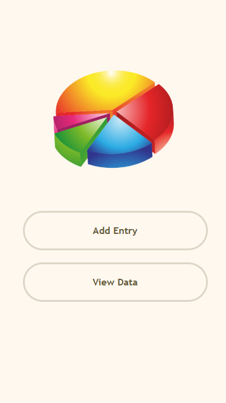
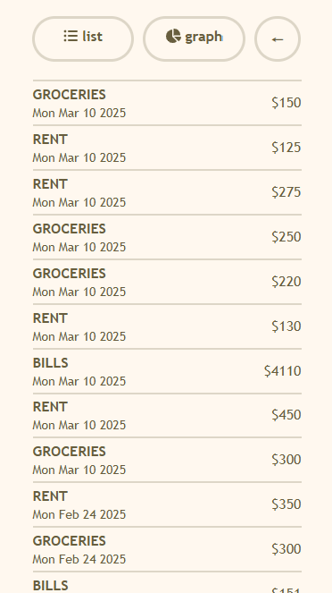
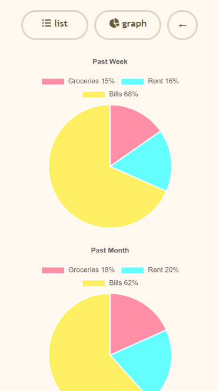

## Unspend - Spending Tracker & Analytics

*repo: https://github.com/sashacheek/budget-app*

Unspend is a spending tracker allowing users to track and view data on their spending habits. It is primarily intended for mobile devices, but works on all devices.

  

To start, run:

```
cd app/clients
npm install
npm run build
npm run start
```

Or with Docker, run:

```
docker build -t unspend:latest -f Dockerfile-client .
docker run -d -p 3000:3000 unspend
```
and view http://localhost:3000/

Unspend it currently being ported to mobile apps with React Native! Repo coming soon.